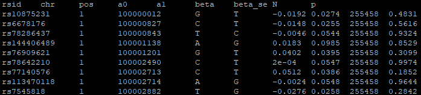
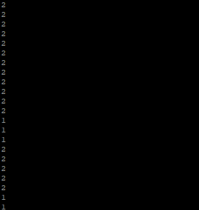

# EX-TERR

> EX-TERR is a methodology for polygenic risk score (PRS) generation, utilizing supervised machine learning to 
combine and priortize polygenic genetic information from multiple different traits from related risk factors.
> Specifically, the pipeline utilizes multivariate adaptive regression splines (MARS) to recalibrate
> and determine the association strength of each input trait. EX-TERR applies MARS to multiple rotated
> genetic variant matrices generated through principal component analysis (PCA) techniques. Uniquely,
> EX-TERR conducts a 5-fold cross-validation (CV) at the genotype level, eliminating the need
> for an initial participant-level train-test split. This addresses potential power reductions
> should GWAS information be unavailable. Further details regarding development and further details
> of EX-TERR can be referred to in the [corresponding manuscript](https://example.com).
>
> This R package automates the pipeline using functions: 
> 

## Table of Contents
- [Installation](#installation)
- [Contact Information](#contact-information)
- [Data Formatting & Required Files](#data-formatting--required-files)
- [Part 1: LDpred2 Conversion](#part-1-ldpred2-conversion)
- [Part 2: Thresholding of Rotated LDpred2 Weights by SD](#part-2-thresholding-of-rotated-ldpred2-weights-by-sd)
- [Part 3: Earth Polygenic Risk Score](#part-3-earth-polygenic-risk-score)
- [Part 4: PRS Association](#part-4-prs-association)

## Installation
The direct installation of EX-TERR can be performed using `devtools::install_github`:

```sh
devtools::install_github("GMELab/EXTERR")
```

If issues are encountered with the above command, a local download can be performed
using the `git clone` command as follows:

```sh
# Enter target directory to download EX-TERR
cd directory

# Initialize git repository
git init

# Download locally using the git clone command
git clone https://github.com/GMELab/EX-TERR

```

EX-TERR can be loaded in `R` using `devtools::load_all`:

```R
setwd("/directory/R")
devtools::load_all(".")
```
This package requires multiple dependencies: `data.table`, `earth`, `caret`, `bigsnpr`, `magrittr`, `dplyr`, `pscl`, `fmsb`
and `glmnet`.

## Workflow

### Overview

The following figure extracted shows a general overview of the overall EX-TERR pipeline:


### Data Formatting & Required Files

EX-TERR requires specific file formats and data preparation in order to execute pipeline.
Details and examples can be found after the summary table. 

| Required File | Brief Description |
|-----------------|-----------------|
| Genome-wide association studies (`.txt`)   | Summary statistics for external data from genome-wide association studies and  outcomes. "Outcome" summary statistics show the circular association between outcome variants and outcome phenotypes, as generated through REGENIE.   |
| Genotype Data <br> (`.bim/.bed/.fam`)  | Genotype data stored as PLINK binary files for outcome data.  Also includes files for allele freqency (.frq) and referenece allele. |
| Phenotype (`.txt`) | Phenotypic information for outcome and validation steps. Also present in various formats | 
| No. of Blocks (`.txt`)   | A simple one-column file indicating the number of "sets" each genotype file is divided into, if formatted as such. |
| Traits lists (`.txt`) | List of traits corresponding to number of external GWAS and outcome traits tested. This pipeline can test multiple outcomes at once. |
| Corrections (`.txt`) | Cofactors of genotype information required for regression analyses, corresponding to participants' age, sex and desired number of genetic principal components (PCs). | 
| Cross validation groups (`.txt`) | Pre-generated file with columns `<chr> <set> <ids>` corresponding to chromosome, set, and group identity (1-5) for the purpose of cross-validation. Default setting is for 5 folds. |
| Masking data information (`.txt`) | Pre-generated file signifying which GWAS traits to mask for each outcome. |
| Rotation information (`.txt`) | Pre-generated file which generate the rotation matrix which will be applied to genotype data, derived from training set genotype data. |

<br> 

#### 1. Genome-wide association study summary statistics 
Genome-wide association study (GWAS) summary statistics represent the association between variants and a specific
trait or disease. The information from summary statistics used for the EX-TERR pipeline should not overlap with 
outcome phenotypes in order to avoid circularity and ensure unbiased effect estimates. 

The columns of the GWAS summary statistics follow the REGENIE output format, with the header:

<div align="center"> 
  
  `<rsid> <chr> <pos> <a0> <a1> <beta> <beta_se> <N>`
  
</div>

The header represents the following information:

<div align="center">
  
| Column | Description | 
|--------|-----------------|
| `rsid` | SNP identifier (Reference SNP ID) e.g. rs123456 |
| `chr` | Chromosome number (1-22) |
| `pos` | Base pair coordinate representing genomic position of the SNP |
| `a0` | Reference allele |
| `a1` | Alternate (effect) allele, which `beta` refers to |  
| `beta` | Regression coefficent, key input of EX-TERR. Estimated effect size `a1` on the trait/phenotype |
| `beta_se` | Standard error of the beta estimate | 
| `N` | Sample size used for the association at that variant | 

</div>

Note that it is important to identify which allele is the reference versus alternate allele for the study.
This can be further specified in the `ref_allele` file (further details 
found in the [Genotype data section](#2-genotype-data)).

<br>

Example:



<br> 

#### 2. Genotype data

The genotypic data correponds to the group of individuals of which the outcome phenotypes are obtained from,
and used for validation within the EX-TERR pipeline. This data should be stored as PLINK binary files (`.bim`/`.fam`/`.bed`/) files as various sets. The following sets 
of participant should be available:

1. **Full cohort**
2. **Training set:** Used to train the MARS algorithm (e.g. 80\% of participants)
3. **Test set:** Used to verify MARS output (e.g. 20\% of participants)

Each set of genotypic data should be available cumulatively (all variants; `genotype_all`), as well as per chromosome 
(e.g. `genotype_chr1`, `genotype_chr2`...`genotype_chr22`). Chromosome data can be further divided into sets for 
larger chromosomes in neccesary (e.g. `genotype_chr1_set1` and `genotype_chr1_set2`). 
Note that a key aspect of EX-TERR is that it **does not** required an initial participant train-test split,
due to a downstream cross-validation step on the genotypic information. Thus, the pipeline can be trained on 
all available participants if desired. 

In addition to the core genotype information, details on allele information should also be prepared. 
Allele frequency information should be available for outcome variants file in the PLINK
format (`.frq`) , with the following column information:

Additionally, it is good practice to include `ref_allele` files to signify which allele from the genotype is
the alternate/effect allele. 

<br> 

### 3. Phenotypic Information

As the overall dependent variable, phenotypes are the outcomes used to ultimately train and validate the EX-TERR pipeline. 
Phenotypes are required in various formats, and are also divided into training and test sets (e.g. `Pheno.txt`, `Pheno_train.txt`, `Pheno_test.txt`). 

1. **LDpred2 Input Phenotypes:** These files should be labeled as `<trait>_<flag>.txt`, where `<flag>` refers to
   whether the participants are from the `train` set or `test` set. Each file is formatted according to a typical
   PLINK phenotype file with three columns `FID` (family ID), `IID` (individual ID) & `PHENO` (phenotype value: 1,2
   and -9) for missing.

<br>

   Example:

<div align="center"> 
  
| FID  | IID     | Pheno | 
|------|---------|-----|
| 1001 | 1001_A  | 1   | 
| 1002 | 1002_B  | 2   | 
| 1003 | 1003_C  | 1   | 
| 1004 | 1004_D  | 2   | 
| 1005 | 1005_E  | 1   | 
   
</div>
  
2. **All Phenotypes for All Participants**: This file contains cumulative information for all participants. The
   first column corresponds to the participant ID, while the following columns contains the respective information
   for each phenotype. There as many columns as there are outcome traits. 

<br>

  Example: 

<div align="center"> 

 | eid | pheno_1 | pheno_2 | 
 |-----|---------|------|
 | 1001 | 1.90 | 0   |
 | 1002 | 2.12  | 1   | 
 | 1004 | 1.89  | 1   |
 | 1005 | 2.01  | 0   | 
    
</div>


<br>

#### 4. Blocks File
If chromosomal genotype data is further divided into sets (e.g. `genotype_chr1_set1` and `genotype_chr1_set2`), this
file is an indicator of how sets each chromosome is divided into. It is a simple one-column file containing 22 rows,
each containing a number indicative of the set count per chromosome. This file has no header. Row 1 corresponds
to the number of sets for chromosome 1, row 2 for sets in chromosome 2, and so on. 

<br>

Example:




<br>

#### 5. Traits list 
Traits lists are required for both the external GWAS and outcome traits used within the pipeline.
Each trait list is a single-column file, with each line containing the name of a trait. External GWAS traits
are further divided into "grid" or "auto" lists depending on which LDpred2 model is used on the given traits.
Typically, the "grid" LDpred2 model is used when phenotypic information is available for the trait. Thus,
the following lists are required. These files are single column lists with no header. 

 1. All GWAS Traits
 2. GWAS Grid Traits
 3. GWAS Auto Traits
 4. Outcome Traits

<br>

#### 6. Corrections file 

These files contain the necessary covariates for correction during regression analyses, containing information 
for participant age, sex, and principal components (PCs). 
The files containing the age and sex information are each two columns,
with the first column indicative of patient ID and the second containing the respective information. The PCs
file contains as many columns as PCs desired for the analyses, plus the first column indicative of patient ID. 
These files should also be divided into the training and test sets (e.g. `Age_train.txt` and `Age_test.txt`). 

<br>

Examples:

- Age


- Sex


- PCs


<br>

#### 7. Cross validation groups

This file contains the group assignment for the purposes of cross-validation. 
It contains four columns with the header `<chr> <set> <ids> <groups>`
The genotypic information at this stage of the pipeline is randomly assigned into five different groups (5 folds),
as indicated by the  `<groups>` column. 

<br>

Example:


<br>

#### 8. Masking data
To eliminate certain GWAS data from the run and simulate "masking" as performed in the manuscript, this file signifies
 which GWAS traits to mask for each outcome. Files are named `<outcome_trait>_masked.txt`, and contains a single column 
 (without a header) of GWAS traits to be removed for that masked analysis. 

<br>

#### 9. Get rotations

If the file is not initially generated, `get_Rotations.R` generates rotation matrices that will be applied to summary statistic data to convert variant information into rotated genetic information. The standard deviation of each rotation is also generated in order to allow filtering of rotated components. 

<br>


### Part 1: LDPRED2 Conversion
All association weightings are initially converted by the LDpred2 model in order to optimize input scores. As such, once summary statistics for 
both external GWAS and internal database associations are obtained, the function `run_LDPred2` allows use of LDPred2 
to reweigh any input weights.

Input parameters:

 | Parameter | Description|
 |-----|---------|
 | `blocks` | Path to blocks file |
 | `trait` | Name of trait |
 | `outcome_db` | Name of outcome database (e.g. UKB). |
 | `rds_in` | .rds file for target outcome genotypes |
 | `bed_in` | .bed file for target outcome genotypes. Required if .rds file not available. |
 | `sumstats_dir` | Path to directory containing summary statistics. File should have the name and format of `[traits]_sumstats.txt` |
 | `freq_dir` | Path to directory containing MAF files. Each file must be in the form of `UKB_09_freq_<chr>_<set>.frq`. |
 | `ref_allele_dir` | Path to the directory containing ref_allele files. Files will be in the form `ref_allele_09` and `ref_allele_09_from_<outcome>`. |
 | `traits_dir` | Path to the directory where the output files will be saved. If `NULL`, the files will not be saved. |
 | `trait_type` | Whether trait is "gwas" or "outcome". |
 | `LDpred2_model` | Use `auto` (no phenotype data available) or `grid` (phenotype data available) for LDpred2. |
 | `phenotype` | Path to the phenotype file, required only when using the "grid" model. |
 | `corrections_dir` | Path to directory containing corrections for Age, Sex and PCs. Files should be in the form `<correction>_disc.txt` |
 | `ncores` | Number of cores used. |

This function returns a list containing two elements: `ldpred2_betadj` & `ldpred2_beta`. These are weights 
after LDpred2 adjustment. `ldpred2_betadj` contains standardized weights, adjusted for allele frequency (MAF), 
where $\hat{\beta}_{\text{adj}} = \hat{\beta} \times \sqrt{2 \times \text{MAF} (1 - \text{MAF})}$. 

<br>

### Part 2: Thresholding of Rotated LDpred2 Weights by SD

In order to improve efficiency and reduce noise by dimension reduction, variant information is rotated using matrices
generated through the `get_rotations()` function. This function only needs to be performed once using the full genotype
data even before the initiation of the entire pipeline, requiring genotype data, chromosome number,
number of continguous variants per block (default = 5000) and the blocks file. 

Once rotations are obtained and the SD are calculated for each rotation, the `convert_LDpred2` consolidates
generated LDpred2 weights for all external GWAS traits and matches them to their correponding rotation SD.
Required arguments are followed:

 | Parameter | Description |
 |-----|---------|
 | `trait_type` | Specifies type of trait and storage directory: `auto`, `grid` or `outcome` |
 | `chr` | Chromosome number (1..22) |
 | `flag` | Set label specifying train or test set |
 | `size` | Size/number of contiguous variants and thus rotated components per block (default = 5000) |
 | `outcome_db` | Name of outcome database (e.g. UKB). |
 | `rotations_dir` | Path to directory containing rotations (as generated from above). File must be in the form `G_PC_SD_<chr>_set_<set>_id_<id>.Rdata`| 
 | `LDpred2_model` | Use `auto` (no phenotype data available) or `grid` (phenotype data available) for LDpred2. |
 | `traits_dir` | Path to the directory where the output files will be saved. If `NULL`, the files will not be saved. |
 | `trait_list_dir` |  Path to directory that contains trait list files. Must be in the format `Gwas_list_<LDpred2_model>` |
 | `blocks` | Path to blocks file |
 | `bim_dir` | Path to directory containing outcome genotype .bim files divided into chromsome and set. Must be in the form `<outcome_db>_09_<chr>_<set>.bim` |
 | `bim_file` | Full .bim file for entire genotype, without division into chromosomes or sets. |
 
Output is returned per set (train/test) for each chromsome and for both independent (GWAS) and dependent (outcome) data. 

Subsequently, the `geno_PCA` function uses the consolidated information to properly threshold and filter the information
according to the desired threshold. An SD threshold of 1.0 can be considered default, and anything higher would be more
conservative and lower would be less conservative. Arguments for this function are as followed:

 | Parameter | Description |
 |-----|---------|
 | `id` | Fold id number (1..5) |
 | `flag` | Set label specifying train or test set |
 | `PC_std_threshold` | SD threshold for filtering of rotated genotype data (e.g. 1.0) |
 | `outcome_db` | Name of outcome database (e.g. UKB). |
 | `rotations_dir` | Path to directory containing rotations (as generated from above). File must be in the form `G_PC_SD_<chr>_set_<set>_id_<id>.Rdata`| 
 | `cv_groups` | Path to cross validation groups file `Cross_validation_groups.txt` |
 | `output_dir`| Name of target output directory |

Output are filtered rotated matrices of genotype data for each of the five CV folds.

Sample code for the SD thresholding step is shown below:

```r
# Attaching each LDpred2 weight to its corresponding SD 
for(chr_no in 1:22){
+ convert_LDpred2(trait_type = "outcome",
                  chr = chr_no,
                  flag = "disc",
                  size = 5000,
                  outcome_db = "UKB",
                  rotations_dir = "Your_Path/Rotations",
                  LDpred2_model = "grid",
                  traits_dir = "Your_Path/Working_Dir",
                  trait_list_dir =  "Your_Path/Traits_List_Dir",
                  blocks = "Your_Path/Blocks.txt",
                  bim_dir = "Your_Path/Geno_Storage_Dir",
                  bim_file = "Your_Path/Geno_Storage_Dir/Geno_All/outcome_all.bim")}
```

<br>

### Part 3: Earth Polygenic Risk Score
This sequence of the pipeline executes the main regression methodology for EX-TERR, implementing Multi-Adaptive Regression 
Splines (MARS) on the rotated LDpred2 weights. This segment applies this correction through the `run_earth` function
and requires all previously processsed files and the following arguments:

 | Parameter | Description |
 |-----|---------|
 | `ids` | Fold id number (1..5) |
 | `PC_std_threshold` | SD threshold for filtering of rotated genotype data (e.g. 1.0) |
 | `size` | Size/number of contiguous variants and thus rotated components per block (default = 5000) |
 | `degree` | Earth parameter allowing for interaction between independent variables (see manuscript for details). Default set to 3.| 
 | `blocks` | Path to blocks file.  |
 | `traits_dir` | Path to directory where initial LDpred2 weights were saved | 
 | `LDpred2_model` | Use `auto` (no phenotype data available) or `grid` (phenotype data available) for LDpred2. |
 | `outcome_db` | Name of outcome database (e.g. UKB). |
 | `mask` | Options are `mask` and `no_mask`. Specifies whether or not to apply masking condition (leaving out most highly associated trait)|
 | `mask_dir` | Path to directory containing data for masking. Not required if mask set to `no_mask`. Files must be in the format *_masked.txt | 
 | `output_dir`| Name of target output directory for PRS modified by earth |

 The final output are earth PRS across each of the 5-folds in both the training and test set. `run_earth` can be executed as followed:

```r
# Run 'earth' PRS code across all 5 folds
for(ids in 1:5){
  run_earth(ids = i,
            PC_std_threshold = 1.0,
            size = 5000,
            degree = 3,
            blocks = "Your_Path/Blocks.txt",
            cross_val_PC_SD = "Your_Path/Cross_validation_PC_SD.txt",
            traits_dir = "Your_Path/Working_Dir",
            LDpred2_model = "auto",
            outcome_db = "UKB",
            mask = "no_mask",
            mask_dir = NULL)
+ }
```


 <br>

 ### Part 4: PRS Association

 The `get_assoc` function generates associations for earth PRS in both training and test sets, 
 providing outputs in the form of $R^2$ values for continuous traits and odds ratios (OR) for dichotomous traits. 
 Arguments are as followed: 

  | Parameter | Description |
 |-----|---------|
 | `flag` | Set label specifying train or test set |
 | `PC_std_threshold` | SD threshold for filtering of rotated genotype data (e.g. 1.0) |
 | `mask` | Options are `mask` and `no_mask`. Specifies whether or not to apply masking condition (leaving out most highly associated trait)|
 | `corrections_dir` | Path to directory containing corrections for Age, Sex and PCs (can be adjusted as necessary). Files should be in the form `<correction>_<flag>.txt` | 
 | `pheno_dir` | Path to directory containing phenotype file (per outcome trait). Name should be in the form `Pheno_<flag>.txt
 | `genotype_dir | Path to directory containing genotype files. Directory contains directories Geno_<flag> and files <outcome_db>_final.fam |

Output files contain association information, adjusted for corrections as specified. 

<br>

### Part 5: Consolidating PRS and Final PRS

The final function in the EX-TERR pipeline is `get_block_PRS`, which consolidations PRS 


## License

## Contact Information
For questions, feedback or other inquiries regarding the EX-TERR pipeline, please contact 
Ann Le (annl.37@hotmail.com) or Guillaume Paré (pareg@mcmaster.ca). 

## Citation
